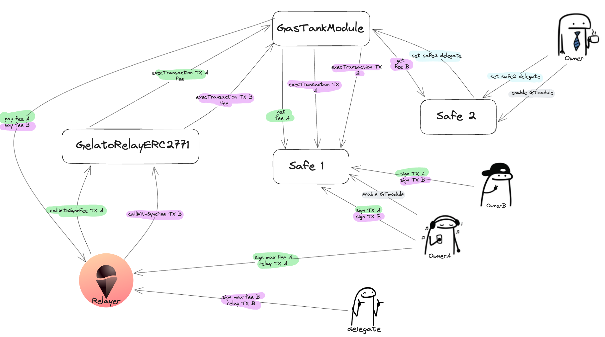

# GasTank Module

The GasTank Module eliminates the need for a user to hold gas tokens in their EOAs, which is required for executing a transaction.
To achieve this goal, the Module offers the following two key functionalities:

1. **Transaction Execution:** The GasTank Module facilitates the execution of transactions within a specific Safe. These transactions are initiated using the [pGelato Network relayer](https://www.gelato.network/relay), allowing them to be executed without the user being burdened with gas requirements.

2. **Gelato Fee Payment:** To cover the Gelato Network relaying services fees, the GasTank Module retrieves the necessary tokens from a Safe designated as the "GasTank". Depending on the organization's setup, it could either be the Safe where the transaction originated or an external Safe (Use case: one GasTank to pay for many Safe's fees).

There are two options to pay for the Relaying fee, depending on where the GasTank is located:

- **Option 1: same Safe from which the transaction is executed** In this case, the transaction executor must be an owner. It is required to sign a series of parameters authorizing the payment of fees from the GasTank.

- **Option 2: a different Safe** The user must be added as a delegate or owner of the GasTank and authorize fee payment.

To put it simply, the GasTank Module addresses the gas expenses incurred during the execution of transactions within a Safe by utilizing tokens to cover Gelato's relayer service fees. It provides users with the option to use the same Safe for execution or a different one, as long as they meet the authorization requirements, thus offering flexibility.

The Smart Contract is designed as a singleton, which means that it can be shared between different Safes, eliminating the need for each Safe to deploy its own module.



## Authentication and Authorization
To authenticate the sender and validate the authorization to pay the fees, two signatures are required.

1. [required by Gelato](https://docs.gelato.network/developer-services/relay/erc-2771-recommended#rationale) to authenticate the sender of the relayed transaction, which then is appended to the calldata passed to the module.

2. Validate that the sender is whether an Owner or a delegate of the GasTank, and is authorized to pay the fees using a given token up to a maximum amount. To achieve this, the module relies on the ERC-721 signature and uses the following schema:

- EIP721Domain
```
{
  EIP712Domain: [
    { name: 'name', type: 'string' },
    { name: 'version', type: 'string' },
    { name: 'chainId', type: 'uint256' },
    { name: 'verifyingContract', type: 'address' }
  ]
}
```
- AllowedFee
```
{
  AllowedFee: [
        { name: 'gasTank', type: 'address' },
        { name: 'token', type: 'address' },
        { name: 'maxFee', type: 'uint256' },
        { name: 'nonce', type: 'uint16' }
    ]
}
```
## Setting a Delegate
To authorize a non-owner to use a GasTank (a Safe) to pay for the transaction of a different Safe, the non-owner account must be set as a `delegate` of the GasTank and indicate which token this new delegate is allowed to use.

For this, the following steps should be followed:
1. Enable the **GasTankModule** on the GasTank.
2. Call the `GasTankModule.addDelegate(address _delegate)` from GasTank.
3. Call the `GasTankModule.addTokenAllowance(address _delegate, address _token)` from the GasTank for each token the given delegate is allowed to use

## Networks
The module would be available on the same address for all the networks where [Gelato is](https://docs.gelato.network/developer-services/relay/networks-and-rate-limits) and also the Safe.

`GasTankModule address: 0x150EfE6b6E093D625313cAe5E7083a4C57fb9BA0`

## Development

### Install Foundry

_Having issues? See the [troubleshooting section](https://github.com/foundry-rs/foundry/blob/master/README.md#troubleshooting-installation)_.

First, run the command below to get `foundryup`, the Foundry toolchain installer:

```sh
curl -L https://foundry.paradigm.xyz | bash
```

If you do not want to use the redirect, feel free to manually download the
foundryup installation script from
[here](https://raw.githubusercontent.com/foundry-rs/foundry/master/foundryup/foundryup).

Then, run `foundryup` in a new terminal session or after reloading your `PATH`.

Other ways to use `foundryup` can be found in the [documentation](https://github.com/foundry-rs/foundry/tree/master/foundryup). Happy forging!

### Install dependencies

#### Yarn

```
yarn install
```

#### Forge

```
forge install
```

### Run tests

Create an `.env` file using `.env.example` as a template, then run.

```
yarn test
```

## License

This project is licensed under Business Source License 1.1.
